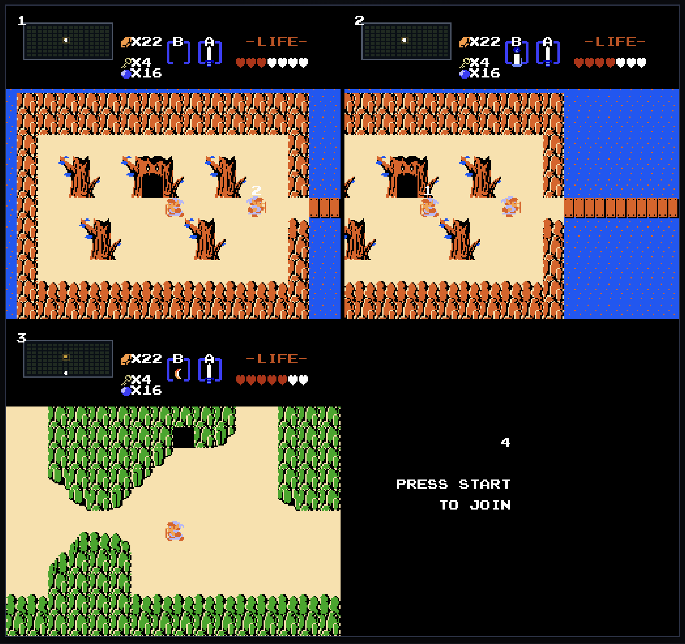

# Dangerous Alone

## Split-screen multiplayer engine for NES Zelda with other enhancements.



This is an unofficial **browser engine** that can play *The Legend of Zelda* (NES, 1986) when you
supply a **legally obtained NES Zelda ROM**. This repository is not a game, not a
Nintendo product, and it does not include Nintendo assets. Maps, graphics, and
audio come from the ROM you drop on the window.

Drop a USA iNES dump once then the engine extracts the cartridge in the browser and
keeps it on the device. From there it can run the full first and second quests:
overworld, labyrinths, caves, combat, items, bosses, saves, and music. What this engine
**adds** is a modern play layer around it:

- **Split-screen co-op** — one to four players share the same world, each with a
full NES-sized camera. Join or leave mid-session; seats can be in different
modes (overworld, dungeon, cave) at once.
- **Continuous camera** — walk the overworld and visited dungeon rooms without
the original screen-wipe. Unvisited dungeon rooms stay fogged until you enter.
- **Readable story** — expanded NPC, pickup, and labyrinth text in a paged
dialogue box, plus map marks for the next dungeon and hinted secrets.
- **Feel tweaks** — arcing sword, integer display scale, keyboard/gamepad
rebinding, and browser saves that survive a refresh.

Solo play is meant to stay recognizable. Nothing here ships Nintendo art or a
playable game by itself — without your ROM, the window is a dropzone.

Up to four NES-sized cameras share one world. Seats can be in different modes
at the same time (overworld vs dungeon here); empty seats wait on Start.

**Runtime:** any modern browser (macOS, Linux, Windows).

In spirit this is to NES *Zelda* what [Ship of Harkinian](https://www.shipofharkinian.com) is to *Ocarina of Time*: an unofficial engine that plays a cartridge you already own, on hardware Nintendo never shipped it for, with extras the original box could not do. We do not wrap an emulator, and we do not ship Nintendo’s ROM or art. The implementation is different — Ship of Harkinian is a native port on a matching decompilation; this repo extracts tables from your dump and reimplements the systems in the browser — but the overall idea is the same.

---


## Play

You need a **legally obtained** *The Legend of Zelda* USA NES dump (iNES `.nes`).
Nothing is uploaded; the file stays in your browser.

**On the web:** [camhenlin.github.io/Dangerous-Alone](https://camhenlin.github.io/Dangerous-Alone/)
(or `play.html` on that site). Drop the ROM and wait for extract. Clearing site
data removes the ROM (saves live in the same browser storage).
`play.html?resetRom=1` forgets the dump without wiping save slots.

**On your machine:**

```bash
npm install
npm run dev
# open http://localhost:5173/play.html
```

**File select:** ↑↓ slot · Enter continue/new · N rename · R register/overwrite · E erase · O options.

**In play:** Arrows/WASD move · Z/Space sword · X/C B-item · Tab cycle item · Enter inventory · H / spare Start joins a second player · F5/F9 practice · M mute · ,/. volume.

Progress autosaves to this browser. Options cover scale, fullscreen, and per-player keyboard/gamepad binds.

---


## Bugs

There are certainly a few bugs and rough edges, but the game is 100% playable as is and don't massively impact the experience.

Notable bugs include:

- There are small collision errors at times, usually making link not fully align to paths. This is mostly a visual bug and doesn't impact gameplay.
- There can sometimes be triggering errors with things in the environment, such as Stalfos. Usually leaving the screen and coming back fixes it.
- Some enemies don't behave as they are supposed to. For example, Dodongos eat bombs much more easily than they should.

If you notice others, feel free to report them as github issues. Please include screenshots and a detailed description of the bug. 


---


## Legal

- This project ships **engine code**, not a cartridge. You bring a NES Zelda ROM you own.
- Nintendo owns *The Legend of Zelda*. Naming it here only describes which cartridge this engine understands.
- Personal / educational use with a ROM in your possession.

---

Building, extracting, tests, architecture, and the phase history live in [`DEV.md`](./DEV.md).